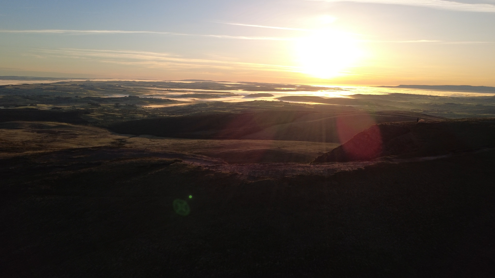

+++
date = "2026-06-06T20:29:00"
draft = true
title = "Wild Camping Alone on the Black Mountain (Western Brecon Beacons)"
categories = ['Brecon Beacons', 'Wild Camping', 'Black Mountain', 'Fan Brycheiniog']
description = "First solo wild camp in the Black Mountain of the Brecon Beacons"
+++

The arrival of the May bank holiday presented the perfect opportunity to break with the monotomy of routine; a chance to escape the normalities of daily life through an overnight visit to the outdoors. Feeling adventurous and determined to conduct my very first solo wild camp, I planned to spend one night alone on the Black Mountain, located in the west of the Brecon Beacons National Park (not to be confused with the similary named Black Mountains, located in the eastern Brecon Beacons), before returning to my car early in the morning, free to enjoy the remainder of the long weekend. With that I loaded up OS maps on my laptop, plotted and exported a route, packed my kit, and began the 220 mile drive from London to South Wales.

Truth be told, the prospect of spending the night alone on a peak was daunting. I've been wild camping on other occassions with friends and family, but going alone felt different. Perhaps it was the primal fear of isolation rearing its head.

The adventurer Alistar Humprheys, defines adventure as _'a state of mind, a spirit of trying something new and leaving your comfort zone'_. If this is true, I could call this outing an advennture on two counts: the experience would certainly be new, and most definatley outside of my comfort zone; having never been in the Brecon Beacons, nor having solo wild camped before, something I put down to spending too long living vicariously though the youtube videos of others. I decided to conduct my very first solo wild camp, spending one night alone on the Black Mountain in the west of the Brecon Beacons National Park (not to be confused with the similary named Black Mountains, located in the eastern Brecon Beacons).

### Kit List

<figure>
   
    <figcaption>The kit I used for an overnight stay in the Brecon Beacons. Backpack is the Osprey Kestrel 48L.</figcaption>
</figure>

The British weather is infamous for existing in varying states of grey miserableness. On rare occassions we are blessed with the sun's appearance and are reminded that it does in fact exist.

British weather infamously varies between grey skies with rain, or greyier skies and even more rain. Unusually, on this trip, I would be hiking while the UK was in the midst of a May heatwave, with temperatures reaching 35°C in parts of the country. On hiking trips, I generally take a single one litre bottle of water and a filter to provide drinking water access access from localised sources on trail. Adjusting my pack to the warmer temperatures, I would be taking slightly more weight than usual, instead carrying two full bottles of water, providing immediate access to two litres. Other adjustments were the inclusion of sunglasses, a baseball cap, and sun cream.

Despite the heat I included both my wet and warm kit in the pack. Regardless of the forecast, weather can change quickly in the localised mountain climate. Additionally, the location I planned to camp at was high on an exposed ridgeline. Being exposed, the possibility for windy conditions was clear. Having access to a shell jacket to provide wind relief would be a good idea. The warm kit would come in handy once the sun began began to drop beneth the horizon, dropping the temperature.

The full breakdown of my core kit list can be [found here](https://lighterpack.com/r/d4v8q5).

### Parking

The 'easiest' location to park for access to the Black Mountain is the Llyn y Fan Fach Car Park (SA19 9UN), a small gravel car park, which allows free parking just a 2.5 mile hike away from the summit of Fan Brycheiniog. I say 'easiest' as accessing the start of the hike from the car park is easy. The drive to the car park itself is anything but, taking you through narrow country lanes with limited visibiity and just enough width for a single car; a rather unnerving drive for a tired city dweller who was feeling rather fed up after six hours in the car. Approaching the car park at 18:00 as many others were leaving, I had to manuvere my car in many awkward ways to allow other drivers to pass. Once arrived, I found the car park to have ample space and had no trouble parking my car.

<iframe src="https://www.google.com/maps/embed?pb=!1m14!1m8!1m3!1d7898.96188476916!2d-3.7458566!3d51.8972069!3m2!1i1024!2i768!4f13.1!3m3!1m2!1s0x486e4d8c9f5fb0cf%3A0x7e2ffda6adbfc1a2!2sLlyn%20y%20Fan%20Fach%20Car%20Park!5e1!3m2!1sen!2suk!4v1781456571085!5m2!1sen!2suk" width="600" height="450" style="border:0;" allowfullscreen="" loading="lazy" referrerpolicy="no-referrer-when-downgrade"></iframe>

### Hiking Up

Following the gravel track out of the car park leads naturally to the start of the trail. I followed the gravel trail as it took me steadily and consistently upwards, reaching a small water reservoir around half a mile in. A short distance on I hit a less defined grassy path that devites off from the main gravel track. Having not yet mastered the art of navigation via my new Garmin watch, I continued walking the gravel path, blissfully unaware I was now heading in the wrong direction towards Llyn y Fan Fach. After glancing at my wrist and seeing the watch informing me that I was off course, I walked back on myself and eventually took the correct path, heading towards the dominering peak of Picws Du, the third highest peak in the Black Mountain area at 749m.

<figure>
    
    <figcaption>The gravel trail leading away from the car park toward the imposing peak of Fan Foel and Picws Du.</figcaption>
</figure>

Walking the grassy path, I began to find the hike surprisingly difficult. The combined factors of the heat, backpack weight, and steady incline ranging between 10-15% made for a good test of my fitness levels. Concerned about the remaining level of sunlight, I comtemplated post-poning the hike towards the summit of Fan Brycheiniog until the morning, and pitching up for the night by Afon Sychlwch, a narrow stream passing on the left of the path. Figuring I had ample time to abandon the remainder of the hike and come back down if necessary, I decided to continue on, reaching a narrow dirt path winding upwards between the peaks of Picws Du and Fan Foel. This section of the trail is a short but steep 0.2 miles, taking you up 160ft in elevation to 2160ft. Taking a minute to catch my breath and take on some water, I stopped and admired the view of the valley below and of Fan Foel directly opposite.

<figure>
 
 <figcaption>Following the trail towards the ridgeline path dividing Fan Foel (left) and Picws Du (right).</figcaption>
</figure>

The summit of Fan Brycheiniog is lies just 0.5 miles directly east from this point. Hiking the steep incline takes you a further 400ft higher, before levelling off, bringing the trig point at 802m into view.

<figure>
    
    <figcaption>Reaching the summit of Fan Brycheiniog at 802 meters.</figcaption>
</figure>

<figure>
    
    <figcaption>The view</figcaption>
</figure>

### Camping at Twr y Fan Foel

With sunlight fading I found a suitable location to camp just off to the left of the summit point at Twr y Fan Foel (meaning Tower of the Bare Peak), providing a view overlooking the forested valley below. Setting up my tent (incorrectly putting the outside liner on inside out, not once, but twice), and arranging my kit inside, I could now relax for the evening.

<figure>
   
    <figcaption>Pitch location at Twr y Fan Foel, overlooking Glasfydd Forest.</figcaption>
</figure>

Taking out my portable hexi-stove and non-hexamine based solid fuel tablets (hexamine is now a regulated explosive pre-cursor in the UK, with ownership punishable by two years in prison, rather more time that I would like to serve for cooking dinner), I planned to make some hot food and a cup of tea, both to be enjoyed while taking in the views below me. This plan was rudely interrupted by the absence of my lighters, both of which I had forgotten to pack and left back in London. Luckily for me, and unluckily for my taste buds, Wayfayrer Chilli and Rice can be eaten cold, so I settled for that, and washed it down with a complementatry cold cup of tea, without milk (also forgotten).

Dinner eaten and cold tea water drunk, I took the opportunity to use the last of the sunlight to take some footage of my surroundings on my DJI Mini 4K. Shortly after, I retired to the tent for the night. As the sun set, the wind began to pick up considerably. Overnight the wind consistently rattled the side of the tent, making for a rather poor nights sleep. Waking at 05:15, the morning report on my Garmin corroborated with my expectations, reporting just 2.5 hours of sleep. Despite not sleeping well, I woke up feeling surprisingly refreshed; the already warming temperatures and clear skies brought on by the heat wave made for a pleasant morning. Taking my tent down, and packing the kit away into my backpack, I sat overlooking the valley while having my breakfast of oats and nuts. By 07:00 I was ready to start my decent back to the car park.

<figure>
 
 <figcaption>A quick photo stop before taking the tent down in the morning.</figcaption>
</figure>

### Hiking Down

From Twr y Fan Foel I followed the ridge line towards the summit of Fan Foel (780m), passing a pair of sheep also taking in the views, around to the opposite side of the peak, offering a great view of Picws Du and Llyn y Fan Fach below.

<figure>
    
    <figcaption></figcaption>
</figure>

<figure>
 
 <figcaption>The route down from Fan Foel, overlooking Picws Du with Llyn y Fan Fach just visible.</figcaption>
</figure>

<figure>
 
 <figcaption>The route down from Fan Foel, overlooking Picws Du with Llyn y Fan Fach just visible.</figcaption>
</figure>

<figure>
 
 <figcaption>The route down from Fan Foel, overlooking Picws Du with Llyn y Fan Fach just visible.</figcaption>
</figure>

From there the route decends back down to the ridgeline dirt path. From here on, the hike down is the reverse of the route taken up; a steady decline back across the grass path and onto the gravel path, back past the water reservoir and towards the car park.

<figure>
    
    <figcaption>Taking a much needed water break a short distance from the water reservoir building.</figcaption>
</figure>

This decision to take the same route down was primarily driven by other commitments over the bank holiday weekend. Wanting to get back to my car in good time I took the most direct route back. Had more time been available I would have continued up and over the summit of Picws Du, looping around the ridgeline and back to the gravel path leading into Llyn y Fan Fach, but that will have to be an adventure for another day.

### Full Route

<iframe src="https://www.komoot.com/tour/3018561689/embed?share_token=aHBE3WcFTrW7fdbqiL1prLSBxflpNiKaN723bVjHYea6ZnpLWb&layout=classic&profile=1" width="100%" height="700" frameborder="0" scrolling="no"></iframe>

### Unused Images

<figure>
    
    <figcaption></figcaption>
</figure>

<figure>
    
    <figcaption></figcaption>
</figure>

<figure>
    
    <figcaption></figcaption>
</figure>

<figure>
    
    <figcaption></figcaption>
</figure>
