+++
date = "2026-06-21T12:00:00"
draft = true
title = "Wild Camping Alone on the Black Mountain (Western Brecon Beacons)"
categories = ['Brecon Beacons', 'Wild Camping', 'Black Mountain', 'Fan Brycheiniog']
description = "First solo wild camp in the Black Mountain of the Brecon Beacons"
+++

As a Software Engineer with a demanding role in the Finance Industry, the majority of my week is spent inside of an office building, where I focus on multiple screens for long hours each day. Inside of work this is to be expected, but the screen usage doesn't stop there; outside of work a screen is always available and rarely more than an arms length away. I often find that what begins as an intentional task such as using my phone to check my emails, turns into a wasted 15 minutes spent doomscrolling pointless content. The screen dominates modern life, be it when commuting, when at work, or when at home, a large portion of my time is spent staring at some form of screen. This may be an odd thing to read coming from a geniune tech enthisiast, but I'm suffering from a case of screen fatigue.

Disconnecting from technology when it is so abundant and omnipresent is a real challenge. In my efforts to reclaim time from the screen, I have found a powerful antidote in the form of small adventures in the outdoors, be it a short walk, a long multi-day hike, or an overnight wild-camp on a peak, an escape into the outdoors is a perfect way to break with the monotony of routine and provides space to disengage from the 24-hour news cycle, notifications, and always on connectivity. With this in mind and a long weekend fast approaching, I was determined to put the free time to good use and conduct my very first solo wild camp, completing an overnight stay in the Brecon Beacons National Park. Truth be told, the prospect of spending a night alone on a peak for the first time was daunting. Still, it was an experience I was determined to have. I was looking forward to the challenge, the solitude, having a novel experience, and ultimately switching off and disconnecting, even if only for an evening.

I began researching suitable locations in the Brecon Beacons to camp. Seeking to keep the crowds at bay, I focused on areas that would be relatively obscure and quiet. I settled on an area known as the Black Mountain, located in the west of the National Park (not to be confused with the Black Mountains in the east). It is home to a range of peaks, valleys, and lakes shaped by glacial erosion during the last Ice Age. With a broad location selected, I refined my route by opening up OS Maps and plotted a hike that would take me directly to the summit of Fan Brycheiniog (802m). Here I intended to pitch my tent on a ridgeline overlooking the valley below for the night. Reaching the summit from the car park would be a short but steep 2.5 mile hike rising around 1700ft in elevation, taking approximatley two hours to complete. Planning to arrive in the late afternoon or early evening, I felt this would provide a sufficient challenge while still being realistic and achieveable given the time constraints.

<figure>
    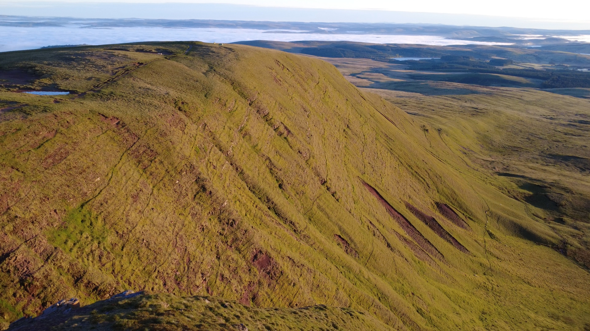
    <figcaption>Fan Foel (781m) at sunrise, a subsidiary peak of Fan Brycheiniog.</figcaption>
</figure>

### Parking at Llyn y Fan Fach Car Park

The Llyn y Fan Fach Car Park (SA19 9UN) is a small gravel car park that is free to use and permits overnight parking. Situated just 2.5 miles away from the summit of Fan Brycheiniog, it provides convenient access to the peaks of the Black Mountain.

The drive to the car park itself is a rather unnerving journey taking you through narrow country lanes with limited visibility and just enough width for a single car. As I began to approach the car park in the evening, the single lane road was filled with day hikers heading home and driving in the opposite direction to me. I had to perform some awkward manoeuvres with my car in tight spaces to allow other drivers to pass. On my approach to the car park I had been driving for six hours and covered 240 miles. I was glad to finally arrive at just after 18:00. To my relief, even on a bank holiday weekend I found the car park with plenty of space and had no trouble parking my car.

### Hiking to Fan Brycheiniog

Following the gravel track out of the car park I progressed steadily upwards, reaching a small water reservoir around half a mile in. A short distance on from the reservoir, a less defined grass path deviates from the main gravel track. Following this path takes you directly towards the domineering peaks of Fan Foel and Picws Du, the second and third highest peaks in the Black Mountain. The path deviation isn't obvious, and having not yet mastered the art of navigation via my Garmin Instinct, I continued walking the gravel path, blissfully unaware I was now heading in the wrong direction towards Llyn y Fan Fach. A vibration on my wrist prompted me to glance down to see my watch informing me that I was now off course, I walked back on myself towards the correct path, another buzz on my wrist confirmed I was back on track.

<figure>
    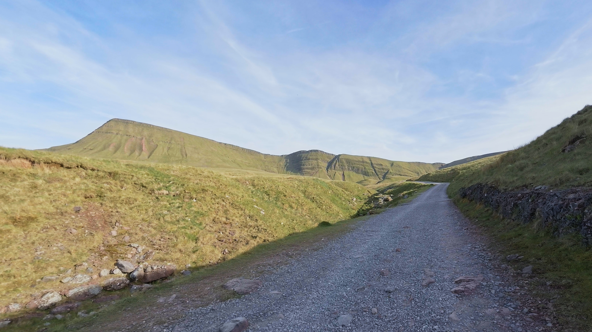
    <figcaption>The gravel trail leading away from the car park toward the imposing peak of Fan Foel (781m) and Picws Du (749m).</figcaption>
</figure>

With temperatures reaching 35°C in parts of the country due to a heatwave, I began to find the hike surprisingly difficult. The heat paried with backpack weight, steady incline and time pressure due to dwindling levels of sunlight made for a good test of my fitness levels.

Concerned about the remaining level of sunlight, I contemplated postponing the hike towards the summit of Fan Brycheiniog until the morning, and considered pitching by a narrow stream passing on the left of the path. However, figuring I had ample time to come back down if necessary, I continued on, reaching a narrow path that winds sharply upwards and divides the peaks of Picws Du and Fan Foel. This section of the trail is a short but steep 0.2 miles that takes you up 160ft in elevation to 2160ft. On the way up I took a short break to catch my breath and took onboard some water, using the opportunity I took a moment to admire the view of the valley below and of Fan Foel directly opposite.

<figure>
 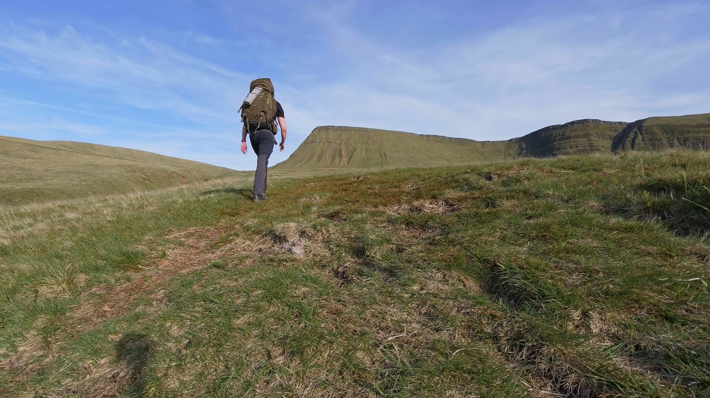
 <figcaption>Following the trail towards the ridgeline path dividing Fan Foel (left) and Picws Du (right).</figcaption>
</figure>

Completing the walk to the top of the ridgeline, the summit of Fan Brycheiniog now lay half a mile directly east. This last section of the trail is another steep incline that takes you a further 400ft higher before levelling off, bringing the trig point at 802m into view.

<figure>
    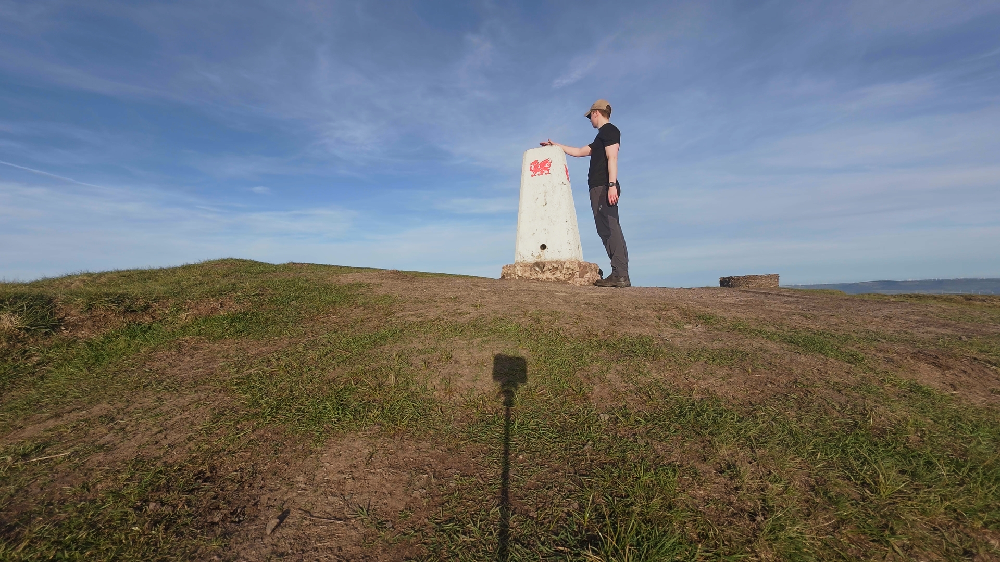
    <figcaption>Reaching the summit of Fan Brycheiniog at 802 metres.</figcaption>
</figure>

<figure>
    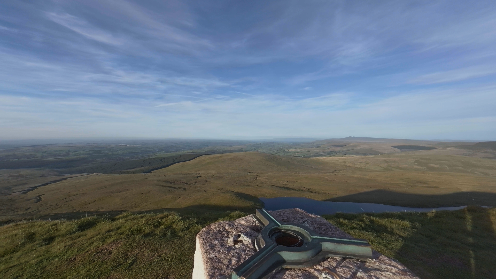
    <figcaption>Overlooking the valley below from the trig point.</figcaption>
</figure>

### Wild Camping at Twr y Fan Foel

With the hike complete and sunlight fading fast, I found a suitable location to camp just left of the summit point at Twr y Fan Foel. The location provided a great view overlooking the forested valley below. Setting up the tent and arranging my sleeping equipment inside, I could now relax for the evening.

<figure>
    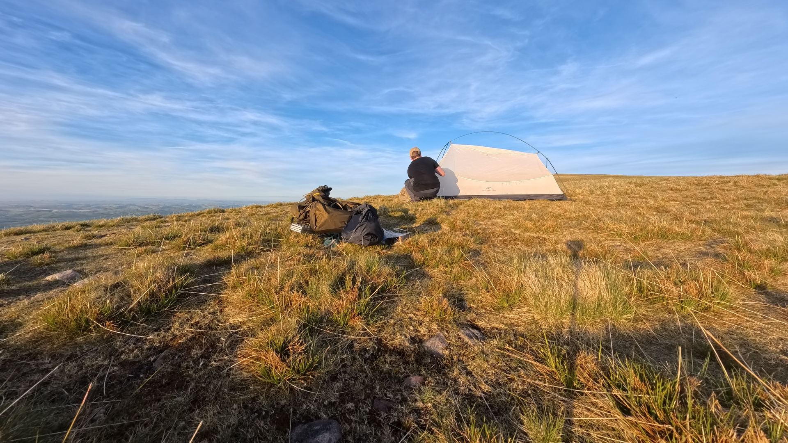
    <figcaption>Pitching the Naturehike Cloud Up Pro at Twr y Fan Foel.</figcaption>
</figure>

Planning to enjoy some hot food and a cup of tea while taking in the views below, I took out my hexi-stove and non-hexamine-based solid fuel tablets (hexamine is now regulated in the UK, with ownership punishable by two years in prison, rather more time than I would like to serve for making dinner). Setting up the stove and mess tins, my plan for hot food was fumbled by the absence of my lighters, both of which I had forgotten to pack and left in London. Luckily for me, and unluckily for my taste buds, Wayfarer Chilli and Rice can be eaten cold, so I settled for that and washed it down with a complementary cold cup of black tea (milk also forgotten).

<figure>
   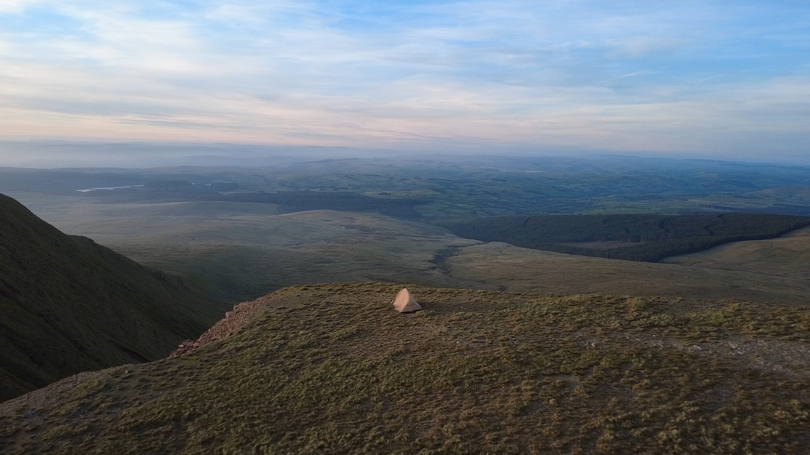
    <figcaption>Pitch location overlooking Glasfydd Forest.</figcaption>
</figure>

Dinner eaten and tea water drunk, I took the opportunity to use the last of the sunlight to take some footage of my surroundings, sending the DJI Mini 4K drone into the air. Shortly after I retired to the tent for the night. As the sun set the wind began to pick up considerably; overnight the wind consistently rattled the side of the tent, making for a poor and fragmented night's sleep.

<figure>
    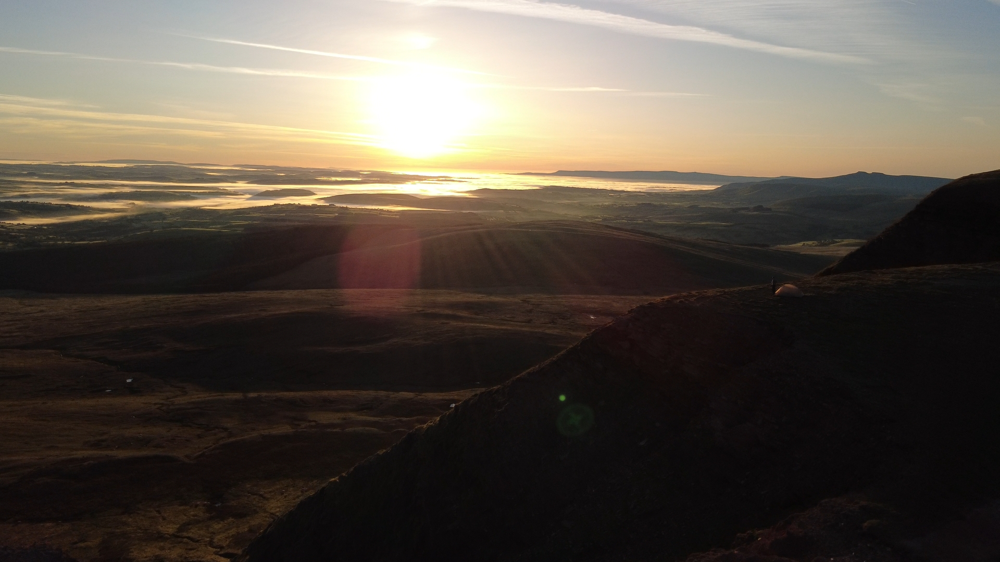
 <figcaption>Sunrise at Fan Foel captured by the DJI Mini 4K. The fog that had formed overnight was still clinging to the valley.</figcaption>
</figure>

The sunlight entering through the tent's sheet walls naturally awoke me early at 05:15. The morning report on my Garmin told me I had just 2.5 hours of sleep. Despite not sleeping well, I woke up feeling surprisingly refreshed; the absence of a loud alarm clock, a stunning sunrise, already warming temperatures, and clear skies made for a very pleasant morning. Capturing the sunrise on the drone, I then took my tent down and packed everything away into my backpack, leaving the area as I found it. I sat overlooking the valley while having my breakfast of oats. By 07:00 I was ready to work my way back to the car park.

<figure>
    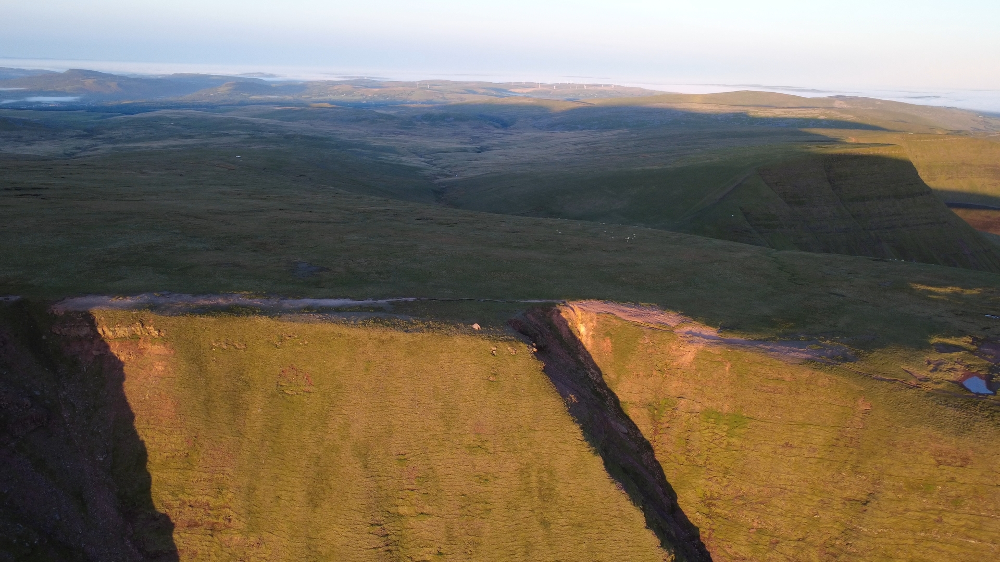
    <figcaption>My tent pitched on the ridgeline at Twr y Fan Foel with Picws Du and Llyn y Fan Fach in the background. My favourite photo from the trip.</figcaption>
</figure>

<figure>
 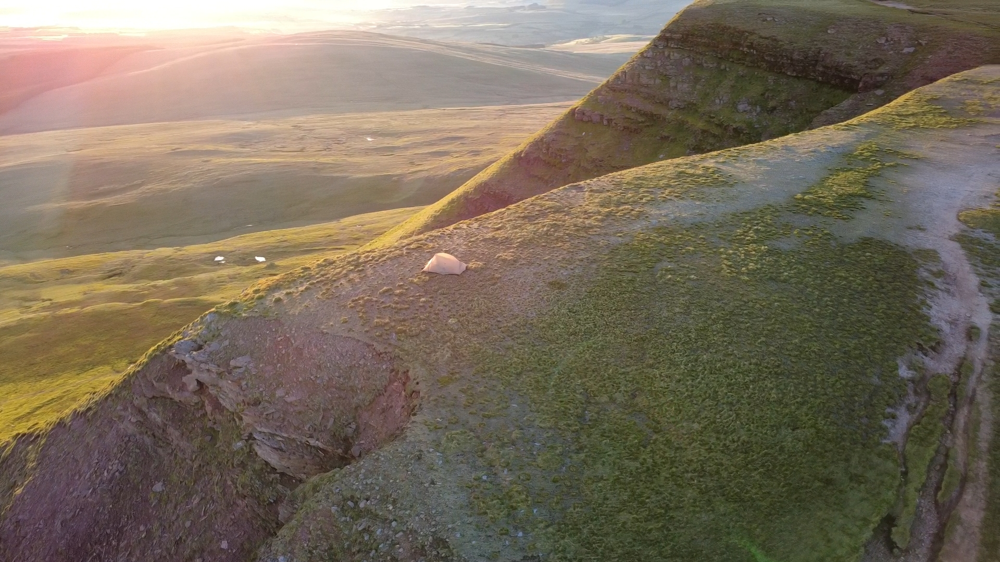
 <figcaption>A still from captured drone footage revealing a worrying amount of earth erosion close to my tent.</figcaption>
</figure>

<figure>
 
 <figcaption>A final photo before taking the tent down in the morning.</figcaption>
</figure>

### Descending to the Car Park

From Twr y Fan Foel I followed the ridge line towards the summit of Fan Foel at 780m, passing a small pool of water and a pair of sheep also taking in the views. Working my way around to the opposite side of the peak revealed a stunning view of Picws Du and Llyn y Fan Fach below it.

<figure>
 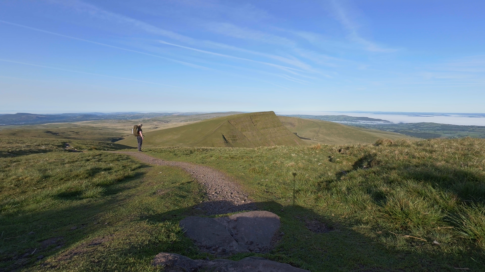
 <figcaption>The route down from Fan Foel, overlooking Picws Du with Llyn y Fan Fach just visible.</figcaption>
</figure>

From there the route descends back down the same ridgeline path used on the hike up. From here, the route down is the reverse of that taken up; a steady decline back across the grass trail and onto the gravel path, past the water reservoir and towards the car park. I took the quickest and most direct route down as I had other plans over the bank holiday and wanted to get back to my car in good time. Had more time been available I would have taken a different route to add variety, continuing up and over the summit of Picws Du, looping around the ridgeline and back to the gravel path leading into Llyn y Fan Fach, but that will have to be an adventure for another day.

<figure>
    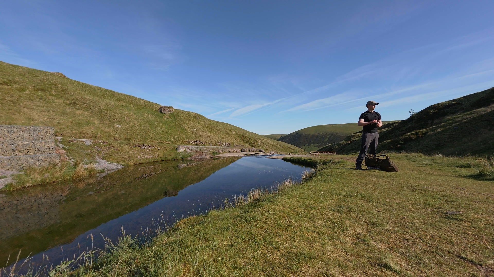
    <figcaption>Taking a much-needed water break a short distance from the water reservoir building.</figcaption>
</figure>

<figure>
    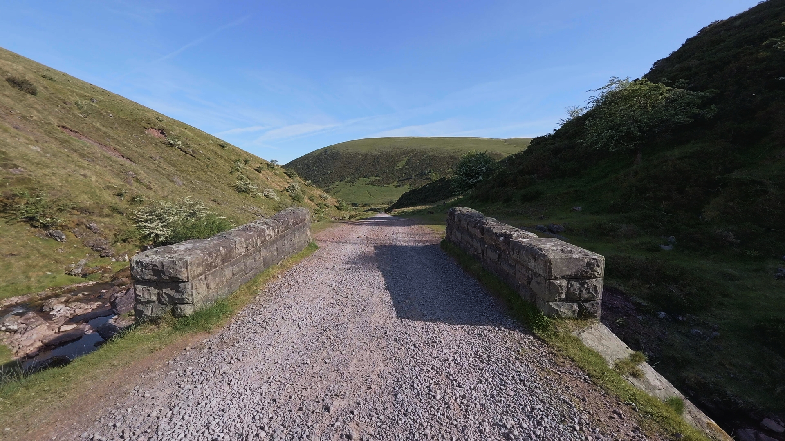
    <figcaption>Walking the gravel trail back to the car park.</figcaption>
</figure>

### Full Route

<iframe src="https://www.komoot.com/tour/3018561689/embed?share_token=aHBE3WcFTrW7fdbqiL1prLSBxflpNiKaN723bVjHYea6ZnpLWb&layout=classic&profile=1" width="100%" height="700" frameborder="0" scrolling="no"></iframe>
