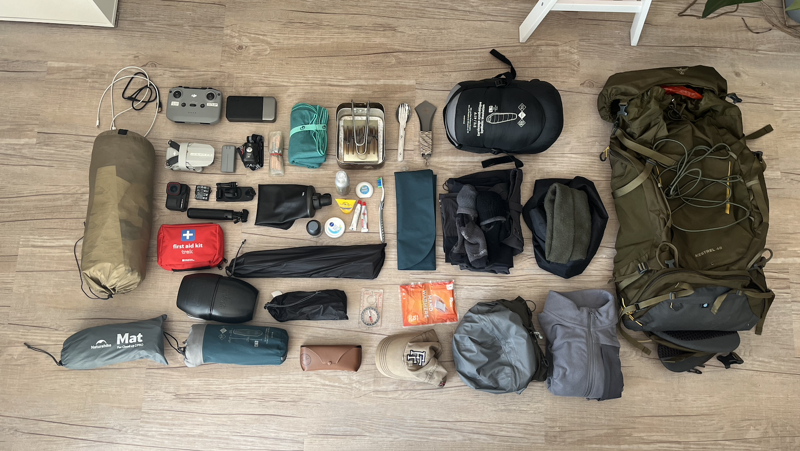

+++
date = "2026-06-06T20:29:00"
draft = false
title = "Wild Camping Alone on the Black Mountain (Western Brecon Beacons)"
categories = ['Brecon Beacons', 'Wild Camping', 'Black Mountain', 'Fan Brycheiniog']
description = "First solo wild camp in the Black Mountain of the Brecon Beacons"
+++

The arrival of the May bank holiday presented the perfect opportunity to break with the monotomy of routine; utilising the free time to introduce adventure and novelty into my otherwise sadly predictable existance. Seeking adventure in small pockets of free time has been something or a personal objective recently, a way to challenge myself to avoid the mistake of thinking that just because I only have a weekend, or few days available, that I can't do something different or adventurous. Capturing the essence of a big adventure, the escapism, novelty and excitement, in a condensed one or two night trip is perfectly feasible.

The adventurer Alastair Humphreys defines adventures as 'a state of mind, a spirit of trying something new and leaving your comfort zone'. With that in mind, on this bank holiday I would embody that spirit and challenge myself to conduct my first solo wild camp. I would be spending one night alone on the Black Mountain, located in the west of the Brecon Beacons National Park.

While I have been on a few previous wild camping trips, wild camping alone has until now, been something I never had the courage to do. Instead, I chose to live vicariously through the Youtube videos of others, finding it preferrable to the innate fear of the mythical mountain axe murderer, who may appear may appear to spoil my peaceful evening in the wilderness. After reading many books on the topic of adventure, and wanting a reset away from screens and technology I decided to bite the bullet and do the thing I wasn't comfortable with. With that, I researched my route, packed my kit and took the 220 mile drive from London to the Brecon Beacons.

### Kit List

A full breakdown of my kit list can be [found here](https://lighterpack.com/r/d4v8q5)

<iframe src="https://www.komoot.com/tour/3018561689/embed?share_token=aHBE3WcFTrW7fdbqiL1prLSBxflpNiKaN723bVjHYea6ZnpLWb&layout=classic&profile=1" width="100%" height="700" frameborder="0" scrolling="no"></iframe>

### Key information

Mountains Summited: Picws Du (749 m), Fan Brycheiniog (802m), Waun Lefrith (677m)

Hike Distance: 16km/ 10 Miles

Hike Duration: 5-7 hours

Elevation gain: 2,125 ft / 725m

Hike Difficulty: Hard

Technical aspects: None

### Parking

### The Route
