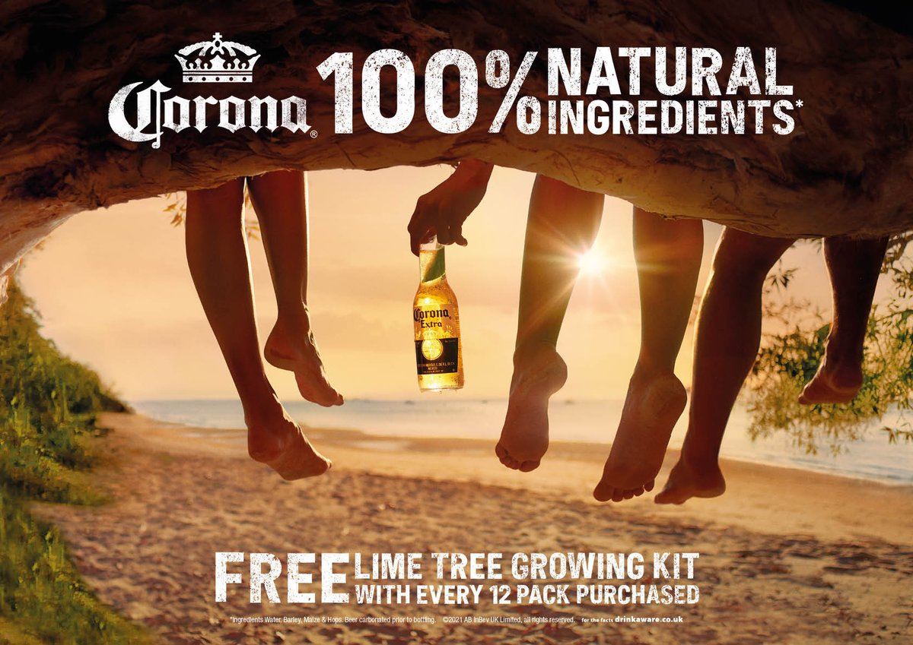
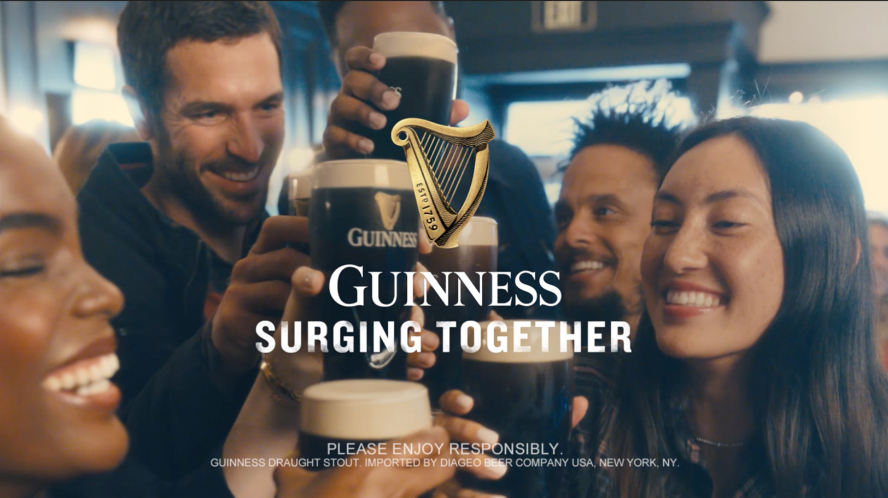

+++
date = "2026-02-09T08:16:00"
draft = true
title = "I Quit Drinking Alcohol for 50 Days - Here’s What Changed"
categories = ['Alcohol Free', 'Reflection']
description = "A personal reflection on completing Dry January and spending one month without alcohol."
+++

At the start of the year, I set myself the objective of completing _Dry January_, the modern phenomenon of abstaining from alcohol for the first month of the year. This decision was experimental in nature, conducted to determine if I too experienced the multitude of benefits claimed by those who live an alcohol free lifestyle; notably, improved energy levels, better sleep, enhanced mental clarity, and improved consistency of output.

Finding the results from just one month alcohol free compelling, I chose to extend the experiment on into Feburary. As I write this, it is February the 19th, and today I will complete my 50th day alcohol free. In this blog, I will discuss my reasons for starting this journey, reflect on my experiences over this peroid of time, share my renewed perspective on alcohol, and detail why I'm excited to conitnue this experiment on.

### Why I Decided to Stop Drinking

#### Protecting Valuable Free Time

In recent years, as I've hit my mid-to-late twenties, the volume of alcohol I consume has naturally declined. Changing circumstances, primarily driven by positive career developments, have constrained the amount of free time that I have. As a result, I place far greater value on the limited free time that I do have, and chose selectivley how to spend it. I want to protect my fleeting free time and make the most of it. Alcohol isn't compatible with this objective because it leads to wasted time spent in a state of self-inflicted misery via the hangover.

Entering into 2026, I was already in a place where I would restrict the volume of alcohol I would consume, or quite happily go without it, often choosing to drink the alcohol free options as a substitute. It therefore seemed a natural and easy step to commit to cut alcohol out completley for the month, and then evaluate if this was to be a more permanent lifestyle change.

#### Prioritising Energy and Focus

I recently read two books that have influenced my renewed views on alcohol consumption: [Hustle Harder, Hustle Smarter by 50 Cent](https://amzn.to/4bpsz5o) and [Clear by James Swanwick](https://amzn.to/4a9cAWG). I was suprised to learn that despite his public persona, 50 Cent largely abstains from alcohol and other vices. Instead, he gets his energy from working out and living a clean lifestyle. He states that this clean lifestyle provides him with the energy to perform consistently. No opportunity is missed due to the impacts of alcohol.

> You have to commit to lifestyle choices that allow you to have the energy, focus, and stamina to actually do the work. _([50 Cent - Hustle Harder, Hustle Smarter](https://amzn.to/4bpsz5o))_.

This is something that resonates with me, particuarly as I suffer badly after consuming relativley small volumes of alcohol. Beyond the three drink mark, I degrade the following day. I become groggy, irritable and lathargic. Everything suffers the day after drinking, from the quality of my training sessions, to the quality of sleep I get, and to the cleanness of my diet. Focus and mental capacity becomes lackluster, diminishing my ability to tackle problems with the energy, creativity, and concentration that is required to perform at my optimal levels.

Feeling this way makes it impossible to operate at my maximum potential. The cost of drinking goes beyond the immediate monetary value spent on purchasing the drinks. There's a longer term opportunity cost caused by the alcohol induced performance lag.

> There's a snowball effect that over the years, adds up to huge losses in performance, success, buisness revenue, personal income, happiness, and fulfilement. _([Clear - James Swanwick](https://amzn.to/4a9cAWG))_.

#### Challenging Social Norms

In Britain, we as a collective have a particuarly unhealthy relationship with alcohol. We have a huge binge drinking culture, and as a nation we drink to excess. That said however, I do view the pub as an important British public instiution that provides the community with a much needed third space, and I certainly don't want to see any more closures. It is the responsbility of the individuals within the pub to be sensible about their consumption. I have a unique perspective on this topic; I happen to live opposite a pub, which provides ample opportunities to observe both the positive and negative responses people have to the effects of alcohol. From my birds eye view, you get to see the full range of human emotions on display, which appear to be hightened under the influence of alcohol. You see it all, from positives such happiness and community, to explosions of anger and envy that lead to poor decisions and regret.

I grew up in the UK, and in my late teens and early twenties, going out with the objective of getting as drunk as possible was the unquestioned norm, particuarly at university. It is so engrained in the culture, that not taking part is very difficult to do, especially when you're young and impressionable. We are all sensitive to the opinions of our peers, and going against the grain marks you out as an oddity, which is an uncomfortable feeling as wanting to conform to the norms of the group is so ingrained in us.

Adding to the pressure to drink that comes from our peers, we also have cultural programming to contend with. This conditioning further reinforces the messaging that alcohol consumption is normal and required.

> Cultural conditioning has led us to believe that alcohol is important and a normal part of our lifestyle. Movies, TV, and commercials paint alcohol as glamorous, fun and an essential part of a life well lived. _([Clear - James Swanwick](https://amzn.to/4a9cAWG))_.

After reading Clear, I began to see the societal conditioning. Look at any advertisement for an alcoholic drink. In almost all cases, the drink is at the center of some event taking place on a beach or a colourful city, filled with happy people having a great time socialising. They sell the idea that drinking is **the central activity** that binds people together in a social setting, projecting the image that you can't be social without having a drink.

<!-- 

_Ads from Corona and Guinness._ -->

Going alcohol free was my attempt to reset the way in which I view societies relationship with alcohol, and in a small way rebelling against the norms.

### What I Gained Going Alcohol Free

I want to make something clear before I continue. Many online claim their experiences of alcohol free living have been life changing. I wouldn't go that far, at least not yet. But there certainly have been improvements to my life that I attribute to the fact I've had a peroid of time without drinking.

#### Improved Energy Levels

The most notably change has been in my energy levels. When I was drinking, it would be commonplace to require a nap, particuarly after work, or in the mid-afternoon on a weekend. It was never something I questioned, I put it down to needing a little more recouporation than the rest of us, which would fit with the active lifestyle I live.

After going alcohol free, I now realise that the root of this problem was in fact a knock on effect from the evenings I did have a drink. Alcohol is very detremental to sleep. It is particuarly damaging to REM sleep, which is crucial for memory consolidation and emotion regulation. So in all likelihood, my napping habits were a response from my body to poor quality sleep.

My natural energy levels are much higher without the impacts of alcohol. I still feel the need to nap from time-to-time, particuarly after hard Jiu-Jitsu sessions, but the frequency of this is much lower and the intra-day tiredness is gone.

#### Clarity of Thought

The accumulated impact of poor sleep, inflamation, and dehydration that is associated with drinking alcohol can lead to _brain fog_; a temporary state of mental impairment in which you struggle to concentrate, think clearly, or remember information.

When I did drink, I would feel this most acutely on Fridays, particuarly when I worked in [The City](https://en.wikipedia.org/wiki/City_of_London), frequenting areas such as Moorgate, Bank, Broadgate, and Leadenhall Market on _**Thirsty Thursdays**_. I no longer work in the City, being in West London for work, but do find myself drawn back into the Square Mile for catchups with old collegues and friends. I never tire of being in the City, it's a special place; I love its history, independence, world significance, and culture (perhaps one for another blog). When this was the case, I would notice the brain

focus for longer durations, no brain fog. feel shsrper, more alrert.

#### An Optimistic Outlook

An unexpected consequnce of not drinking has been that I feel I have a more optimistic outlook.

#### Understanding True Confidence

Throughout this expeiment I have continued living my social life as I normally do. I haven't limited the type of environment I would go to, or who I would see, just because I wouldn't be taking part in the drinking. I've still visited pubs, attended football games, and gone to nice resteraunts, all places I would use to have a drink at. This has further helped to decouple any association between alcohol and socialisation that I may have held. To avoid these types of activities and shell up because you wont be drinking would be very dangerous, you need to experience life as you normally would to be able to appreciate the upsides of not drinking.

> Through the process of going alcohol free you will break the mental link between alcohol and socalisation. _([Clear - James Swanwick](https://amzn.to/4a9cAWG))_.

After experiencing life without alcohol, you being to realise that you don't need it to be socialble, and question all the situations in which you've relied on alcohol to project confidence. In the absense of the default fallback, you undestand what true confidence is, and that is the confidence that comes not from external sources, but from yourself.

> No matter what situation or setting you find yourself in, you don’t ever want to depend on anything—or any other person—to make you feel in control and comfortable. That sense of confidence should always come from within. Not from an external source. _([50 Cent - Hustle Harder, Hustle Smarter](https://amzn.to/4bpsz5o))_.

### Will I Continue This Experiment?

For now yes! I'm not going to be foolish enough to say I'll never drink again, I may well do, but I may also not do. I really do not know. I do know however, that during this peroid, I have emjoyed the consistency, energy and clarity I've experienced. I like the fact I wake up feeling the same everyday. I haven't missed drinking, or feel I've lost anything from my life (except hangovers). I've only gained things. For now, I'm excited to continue this on and see where this goes. Thanks for reading!
