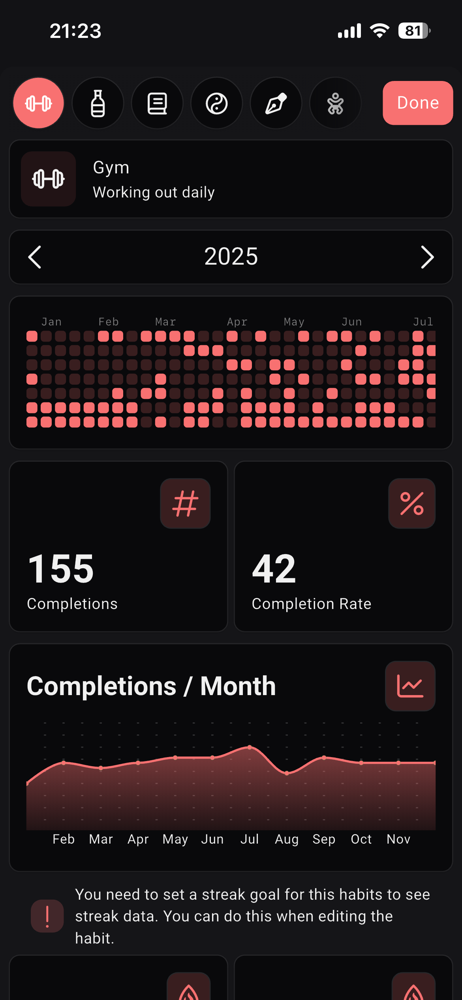
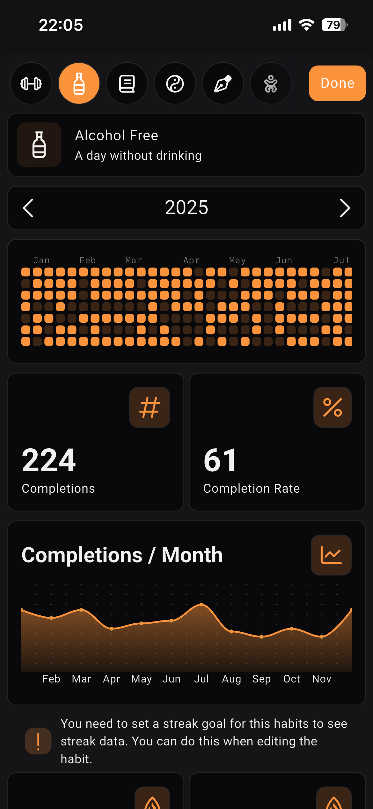
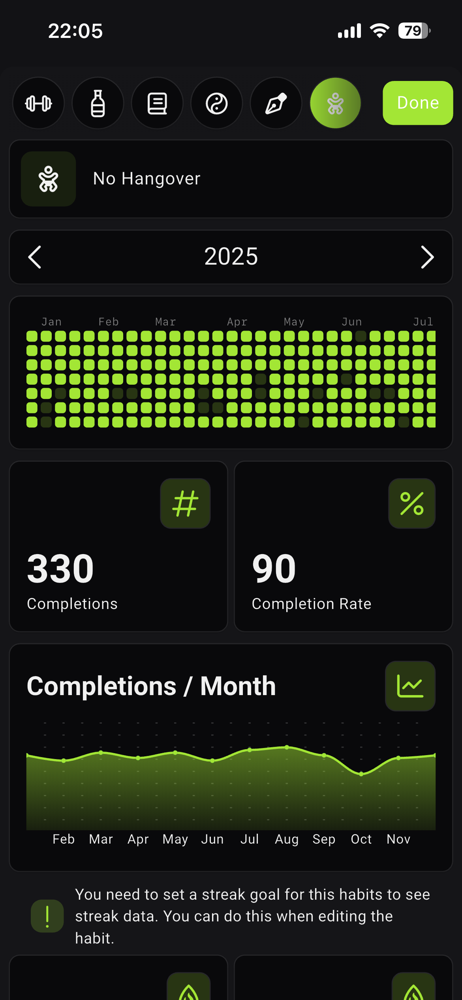

+++
date = "2026-01-03T09:43:00"
draft = false
title = "Setting My Objectives For 2026"
categories = ['goals', 'reflection', '2026']
+++

The start of a new year is the perfect opportunity to reflect on the direction of our lives over the prior twelve months. It is a chance to evaluate our current circumstances and set directional objectives to help us achieve goals and address any imbalances.

This blog post is my attempt at doing just that. I have taken the time to reflect on what I want to achieve this year, and decided that writing it down in a document I can refer to as the year progresses is a great way to hold myself accountable to my objectives. With that in mind, here is my list of objectives for 2026.

## Create a Healthier Work-Life Balance

In 2024, I felt it was time to explore new opportunities and move on from my role as a Software Engineer at a large Asset Manager in the City of London. It was not an easy choice to make; I had spent six years with the company, having joined as an Industrial Placement Student experiencing their first _proper_ job. Over that time, I grew deeply familiar with the environment and felt a strong sense of comfort and loyalty to the firm.

Having decided to move on, I needed to define what I truly wanted from my next role. Most importantly, I was looking for an environment that would challenge me; I didn't want a sense of comfort, being overly comfortable is not conducive to personal growth. I found that opportunity and began a new position in December of 2024.

From a professional perspective, the move has been incredibly fulfilling. At a relatively young age, I’ve been given the opportunity to lead the development of a key initiative and take on a significantly higher level of responsibility; being the first software engineer within the team naturally came with greater exposure and accountability. I now work in a fast paced environment where I’m challenged frequently and learning every day. It is exactly the kind of role I was looking for when I made the decision to move on.

While my professional life has flourished, the increased intensity of the role and the longer daily commute have highlighted the importance of maintaining a healthy balance between my professional and personal life. On a typical weekday, I now average around three hours of free time in the evenings, which I accept as part of the role. One area where this lifestyle change has had an impact is my personal fitness. Over the past year, I’ve been less consistent with the gym and martial arts training, and I move less during the day than I used to, leading to some weight gain. It is my responsibility to prioritise exercise and establish a better balance to maintain my health.

**2024 vs 2025 - Days Including Martial Arts Training**

Each green dot represents a day I trained either Gracie Jiu Jitsu or Krav Maga. Both are important hobbies of mine that contribute to mental and physical health. In 2025, due to the change in lifestyle associated with the intensity of focus I put into the new role, I found it difficult to attend the classes with the same frequency as I did the previous year. This led to a 22.9% reduction in the number of days that I went to train when contrasting 2024 with 2025.

  
  

**2024 vs 2025 - Days Including Gym Training**

A similar impact was seen on the frequency of my weight training regime within the gym. Each dot represents a day where I went to the gym. I had an 8.28% decrease in the volume of my training when contrasting 2024 with 2025. The number isn't as drastic as it is with the martial arts due to the discipline I had in getting myself into the gym at ungodly hours before commuting into work. If I'm being realistic with myself I don't feel I can sustain that indefinitely, switching to a lunch time training regime will bring better overall balance, allowing myself to have sufficient rest overnight to feel refreshed in the morning. This wasn't the case last year and isn't something I want to repeat.

  
  

To address these imbalances, I will commit to working from home one day a week. This will eliminate two hours of commuting, allowing me to re-purpose that time for productive means such as training early in the morning without needing to wake up at unreasonably early hours, and attending martial arts classes in the evening without having to leave work early. On that day, I can maintain focus at work while also dedicating time to my personal hobbies.

I will continue to be in the office four days a week. On those days, I will commit to incorporating at least one form of exercise during lunch, whether attending the provided martial arts classes or using the gym, or alternatively taking a walk outside. I need to be more intentional and confident in taking that time to step away from work when it is appropriate to do so, recognising that I’ve been so absorbed in my work that I haven’t given myself the space to maintain my health and energy.

I hope this strategy will create a better balance, enabling me to pursue a rewarding professional career while continuing to enjoy the hobbies and activities that bring me joy and sustain my overall happiness.

## Moving Further Into London

For most of my life, I have lived in one of London’s suburbs, commuting daily into central or west London for work. My total commute is now close to two hours per day. Given recent lifestyle changes, I feel it is time to move closer to central London. Doing so would reduce my total commute to around forty minutes. It would also mean getting home at 19:30 rather than 20:00, compounded over time that will certainly help in finding more balance between professional work and life.

Beyond the time savings, living further out carries an opportunity cost. Suburban life limits spontaneity: while my peers in central London can go out on a whim and stay out late, I often find myself checking train schedules due to the notoriously unreliable national rail service. For planned events, staying overnight in a hotel is manageable, but the need to leave earlier in spontaneous social opportunities is a drawback. Since the majority of my social and professional life revolves around London, it makes sense to live where the action is.

## Completing Dry January

I am by no means a big drinker, but I do enjoy the odd pint with friends, family and collegues. Typically, at least one night during the week involves some form of alcohol. There is a catch though: it doesn't take many drinks over the course of an evening to wreck my next day. Even three pints over an evening can leave me feeling lethargic and less energetic, often being consumed by an overwhelming desire to sleep the following day. Consuming small to moderate amounts of alcohol is all it takes makes me feel groggy, miserable and generally off, reducing my performance in all aspects of life. It is hard to operate at 100% when you feel that way.

As a result I've often flirted with the idea of abstaning from alcohol, managing to do so for twelve consecutive days in 2025. It's shocking when you consider that since age 18, I haven't had more than twelve consecutive days without alcohol. While I didn't manage to completley rid alcohol from my life last year, I did reset my relationship with it to a certain extent, rarely exceeding three drinks in an evening when going out.

**2024 vs 2025 - Alcohol Consumption**

Each dot on the first two charts represents a day on which I did not consume alcohol. Any alcohol consumption, from a single sip to multiple pints, is shown as a gap. The third chart represents days on which I did not experience a hangover; if there is a gap, this means I felt the impact of the drinking in any way the following day, it does not necessarily mean I was suffering from a full blown hangover in _traditional_ sense. The good news is an 8.74% increase in the number of alcohol free days year over year. One clear pattern that remains is the influence of city culture, with a clear tendency to go for drinks on Thursday evenings, followed by feeling some form of impact on a Friday.

  
  
  

The vast majority of this drinking in 2025 was sensible, typically being restricted to one or two pints. Despite this, I still managed to waste almost 10% of my year in some state of hangover. I get such little free time that I cannot justify wasting another minute in a state of self-inflicted misery. So for this year I am fully commiting myself to Dry January. This isn't a commitment to quit forever, but I am curious to complete a month without any alcohol and assess how I feel, with a view on extending into February if I find the benefits compelling enough to continue on.

What I’m ultimately seeking is consistency: consistently training in the mornings, consistently having the energy to work on side projects, and consistently performing at my best professionally. Even small amounts of alcohol disrupt that consistency, so I’m interested to see what I can achieve by experiencing the compounding effects of daily clarity without interruption.

## Committing to Build in Public

I spend a large proportion of my free time building side projects. This habit has brought benefits to my professional work; developing technical skills outside of the workplace has been one of the main reasons my technical abilities are where they are today.

The vast majority of these projects never see the light of day. Most often this is because I do not complete them, but more importantly it stemmed from the discomfort of sharing my work online and the fear of putting myself in the public domain. It wasn't until I read [Show Your Work]() that my mindset began to change. I now understand that if your work is not discoverable it might as well not exist. There is little to be gained by keeping what we have learned in isolation.

After reading that book, I bought this domain and launched my personal blog: taking my first steps towards being comfortable putting myself in the public domain. This year, I want to take this further by committing to build in public. If you're unfamiliar with the term, building in public is the practice of creating a project while openly sharing the progress, decisions, successes, and failures. Being transparent with the successes and failures, learning in public, and sharing milestones are all part of the process.

2026 will be the year of publicly shared side projects. I look forward to showing the work I’m doing in my free time through my blog, my X account, and potentially YouTube. I want to shift from a consumer of content to a creator of it.

## Writing Book Summaries

I fill the daily commute by reading books. Usually, I read for at least thirty minutes per day. Once I've finished a book that tends to be the end of my interaction with it. As a consequence, I'm left with a bunch of highlights on my kindle that I never look at again. I feel like that is wasting the information; generally if I highlighted it, it must have resonated with me in some aspect.

To address this, I plan to use this blog as a space to summarise the key takeaways from every book I find interesting enough to complete. Over time I aim to build a space which I can refer back to, helping me retain and reflect on the ideas that stood out. Sharing these summaries publicly also aligns with my broader goal of building in public, just not by in the traditional sense of building a technical project, but by curating and sharing a collection of extracts I found interesting.

## 1 Second Everyday

1 Second Everyday is an app that lets you record one second clips of your life every day. My friend [James](https://jamesjarvis.io/) introduced me to it during university; he has nearly ten years of his life condensed into tiny clips. I think it is nice to be able to play back your life in these little one second snippets. I tried it in the past but didn’t stick with it. This year, I’m determined to complete a full year, capturing small moments that might otherwise be forgotten.

## Take a Wild Camping Adventure

There's a guy YouTube called [Liam Brown](https://www.youtube.com/@LiamBrown) who records his solo hiking and wild camping adventures that he takes all across the globe. I've always enjoyed the outdoors and camping, so this year I want to plan and complete a similar style of trip myself. I want to embark on an unusal trip, immerse myself in nature and get away from technology and screens for a period of time.

## Explore London's Cigar Lounge Scene

Recently, I visited _Boisdale of Belgravia_ for my first authentic cigar night. While not the healthiest habit to consider developing, to my surprise, as someone who cannot stand being in any proximity to cigarette smoke, I found the experience rather enjoyable; a chance to relax, take time out of the day and have meaningful conversations.

Therefore, I am keen to explore more into this scene and visit some of the other locations around London, albeit certainly not a frequent basis.

## Word of The Year

If I were to summarise these objectives in a single word, it would be rebalance. After an intense 2025, I want to restore the consistency and frequency of training I once had, while also exploring life without alcohol to ensure I am always feeling at my peak.
